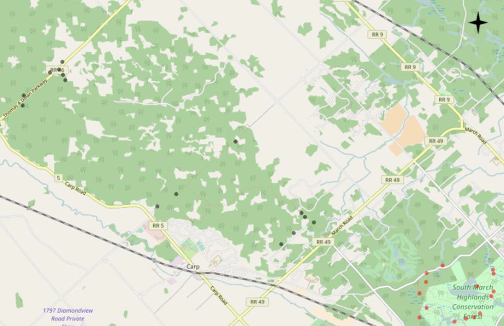

*data used in this project can be found in my github repo: (https://github.com/Rui-Zzhang/BIO8102-Term-Project)

## 1 Introduction (10%)
### 1.1 Background

*Bacillus thuringiensis subsp. israelensis* (Bti) is a biolarvicde that is widely used in Europe and North America for mosquito control, due to its reputation of being an effective, environmentally-friendly and mosquito-specific biocide (Despres et al., 2011). As a bio-larvicide, the toxicity of Bti to mosquito larvae is associated with its Cry and Cyt toxins produced as crystals during bacterial sporulation, which are solubilized in the gut of the mosquito larvae after ingestion (Ben-Dov, 2014). The toxins can then bind to certain protein receptors on the gut cell membrane, leading to the oligomerization and disruption of the gut, which ultimately cause the larval death (Vachon et al., 2012). The specificity of this toxin makes it an ideal larvicide to control larvae of the suborder Nematocera, which includes mosquitoes, black flies and chironomids (Lacey, 2007). 

(*reference above came from Carsten A. Brühl et al., 2020)

For the above benefits, the City of Ottawa initiated a pilot project to investigate the effect of Bti on eliminating the local mosquito population in Kanata in response to increased complains from local residents about mosquito nuisance. The bio-larvicide was applied for three years in South March Highlands Conservation Forest (SMHCF) from 2016 to 2018.  With the close monitoring of its effects on mosquito populations, the University of Ottawa MSc student Liam Epp collected data about the number of mosquitos in the Bti treated and control sites, along with the sediments from those area. His study concluded that statistical modelling failed to show Bti treatment as a significant predictor of mosquito quantities (Epp, 2018). 

### 1.2 Study system and hypothese

As one of the drivers for biogeochemical cycling of various nutrient and other elements, soil microbiomes are essential for the survival and prosperity of plants and animal life (Jansson., 2020). Following the lack of evidence of Bti as an effective bio-larvicide in reducing mosquito populations in Kanata, we thus wondered whether Bti can affect the local soil microbiocidal communities and alter their structures.  (https://www.nature.com/articles/s41579-019-0265-7)

Bacillus thuringiensis (or Bt) is a Gram-positive, facultative anaerobic endospore-forming bacterium that is commonly found in soil as well as estuarine sediments. It can also be found naturally on leaf surfaces, aquatic environments, animal feces and insect-rich environment (ref: brock biology of microorganisms). Due to its soil-dwelling property, we hypothesize that its application would alter the soil microbial structures, thus result in a change in microbial diversity as well as relative abundance. 
## 2 Methods (20%)
### 2.1 Data collection 

Bti was applied in South March Highlands Conservation Forest (SMHCF) for three years from 2016 to 2018. As shown in figure 1, red circles represent the Bti treatment sites within SMHCF where soil samples were collected (i.e., 15 treatment sites), and the green dots represent the control sites without Bti treatment where soil samples were collected (i.e., 15 treatment sites). Soil sampling started a week after Bti was applied each year. Sampling was conducted from May to August on a weekly basis in each year (i.e., 12 weeks per year), thus soil at each sampling location was collected repeatedly for 12 times each year. 

However, the above methodologies are only an ideal scenario, and an incomplete dataset were provided in reality. Data from 2016 were largely missing, thus has to be excluded. For 2017 and 2018, we only have data available for 7 treatment sites (site number: 1,4,6,9,12,14,15) and 6 control sites (site number: 19, 20, 23, 24, 28, 30). In addition, the number of times each sampling location was measured vary from 3 to 5, nothing close to what was originally proposed of 12 times. 

{width=50%}

Soil samples were collected near water ponds, then pH, Conductivity (uS), temperature (deg Celsius) and dissolved oxygen (DO) (mg/L), as well as the concentration of ammonia (mg/L) and nitrate(mg/L) were recorded along with the soil samples. Soil samples then subsequently underwent DNA extract and sent to a sequencing facility for 16S rRNA sequencing. The samples were processed and analyzed using the Quantitative Insights into Microbial Ecology (QIIME2, version 2020.8) (Bolyen et al., 2019) custom pipeline. Alpha diversity metrics were obtained, which are measures of species diversity within a sample. Here we obtained three alpha diversity metrics generated by QIIME2 including Shannon’s diversity index, Pielou’s Evenness and Faith’s Phylogenetic Diversity, which are all continuous real numbers. 

### 2.2 Statistical approach
In this project, we will be mainly examining the effect Bti treatment on these three-alpha diversity metrices by accounting for the physical chemical parameters as well as week and year using various statistical approach. 

## 3 Results (25%)

## 4 Discussion (15%)

## 5 Reference

## Style (30%)
* clarity and code reproducibility (10%)
* organization (5%)
* clarity of text (10%)
* Typos and grammar (5%)

